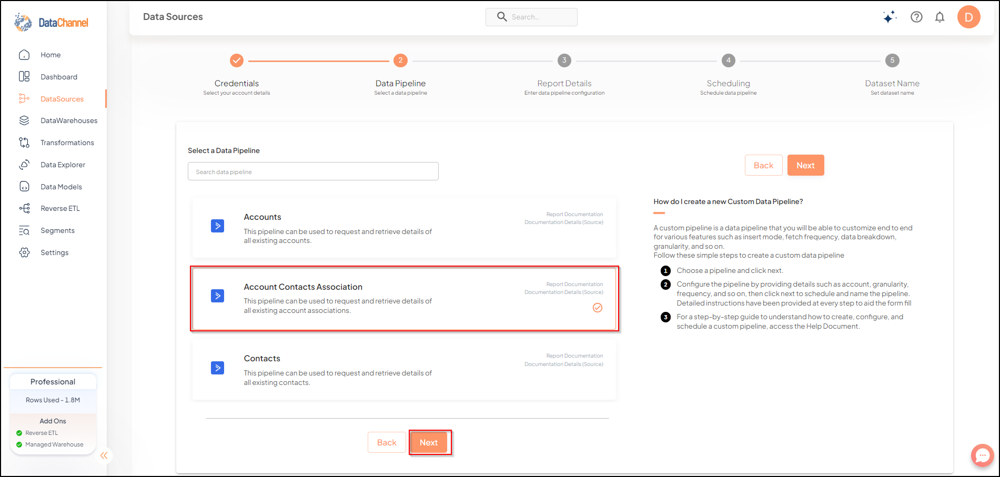

# Account Contacts Association

This Account Contacts Association pipeline can be used to request and retrieve details of all existing account associations.

Read more about the Account Contacts Association pipeline [here](https://developers.activecampaign.com/reference/list-all-associations-1)

## Configuring the CredentialsSelect the account credentials which has access to relevant Active Campaign data from the dropdown menu & Click btn:\[Next]

***

Credentials not listed in dropdown ?::Click on btn:\[+ Add New] for adding new credentials

***

## Data Pipelines DetailsData Pipeline::

Select _Account Contacts Association_ from the dropdown

## Setting Parameters

| Parameter   | Description                                                                                                                                                                                                                                                                                                                                                                                                                                                | Values                                                                                                          |
| ----------- | ---------------------------------------------------------------------------------------------------------------------------------------------------------------------------------------------------------------------------------------------------------------------------------------------------------------------------------------------------------------------------------------------------------------------------------------------------------- | --------------------------------------------------------------------------------------------------------------- |
| Insert Mode | 
<strong>Required</strong> This refers to the manner in which data will get updated in the data warehouse, with 'Upsert' selected, the data will be upserted (only new records or records with changes) and with 'Append' selected, all data fetched will be inserted. Selecting 'Replace' will ensure the table is dropped and recreated with fresh data on each run. Recommended to use "Upsert" option unless there is a specific requirement.
 | 
<code>Upsert</code>, <code>Append</code>, <code>Replace</code> <strong>Default Value:</strong> Upsert
 |

