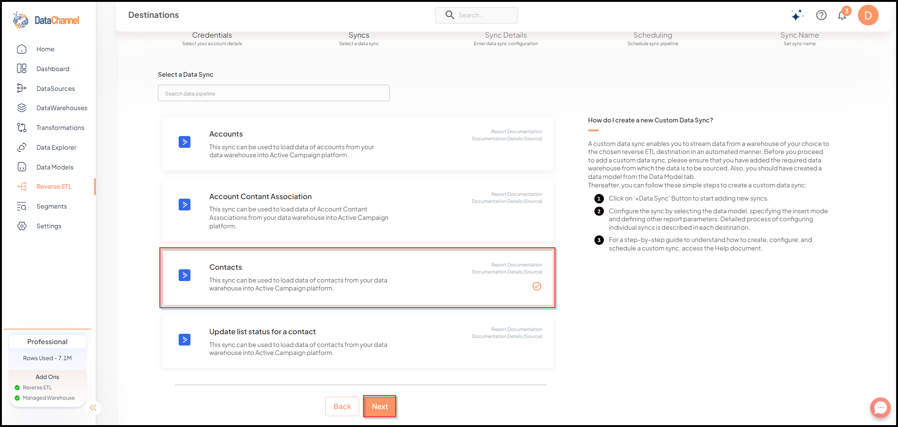
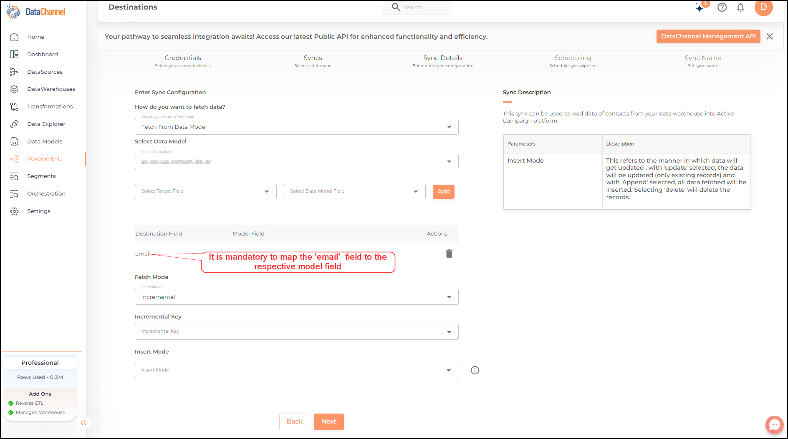

# Contacts

This Contacts pipeline can be used to request and retrieve the details about existing contacts. Each contact represents a unique email address.

Read more about the Contacts pipeline [here](https://developers.activecampaign.com/reference/list-all-contacts "window=_blank")

## Configuring the CredentialsSelect the account credentials which has access to relevant Active Campaign data from the dropdown menu & Click btn:[Next]

****

Credentials not listed in dropdown ?::Click on btn:[+ Add New] for adding new credentials
****

## Data Pipelines DetailsData Pipeline::
Select *Contacts* from the dropdown

## Setting Parameters
| Parameter | Description | Values |
|-----------|-------------|--------|
| Insert Mode | **Required** This refers to the manner in which data will get updated in the data warehouse, with 'Upsert' selected, the data will be upserted (only new records or records with changes) and with 'Append' selected, all data fetched will be inserted. Selecting 'Replace' will ensure the table is dropped and recreated with fresh data on each run. Recommended to use "Upsert" option unless there is a specific requirement. | `Upsert`, `Append`, `Replace`   **Default Value:** Upsert |
| No of Days | **Required** Enter the number of days for which you wish to get the data in each run. | Integer value |

