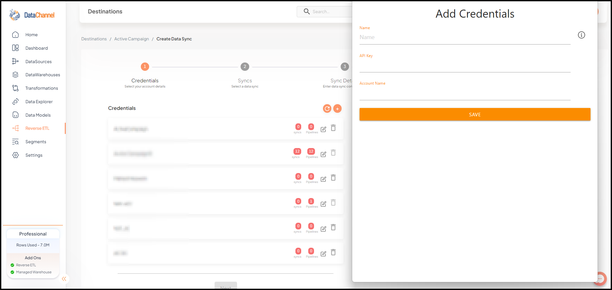
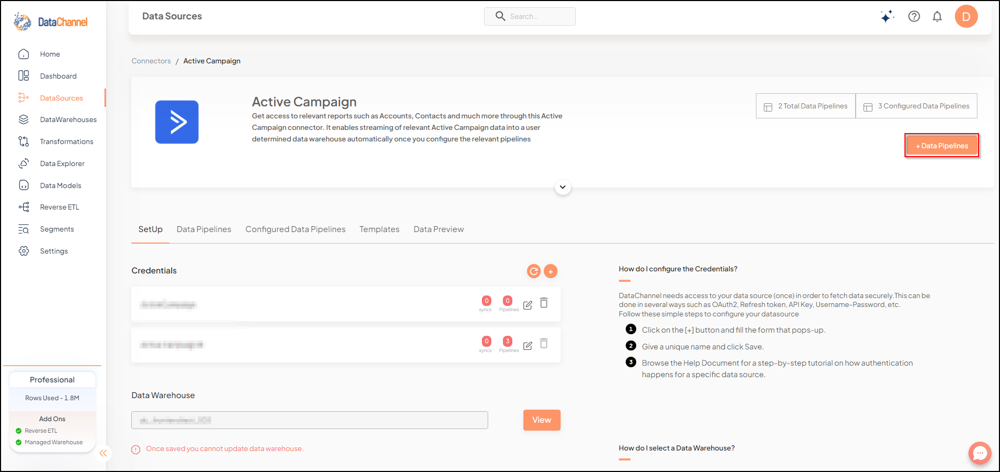

# Setup Guide - Active Campaign

Follow our setup guide to connect Active Campaign to DataChannel.

## Prerequisites

To connect Active Campaign to DataChannel, you need:

* An Active Campaign account with permissions to access data from accounts you'd like to sync and decide which breakdowns and fields you'd like to sync.
* An API Key. The process to retrieve this key is described [here](https://developers.activecampaign.com/reference/authentication).

## Setup Instructions

1. Select a xref:destinations:index.adoc[data destination] for your Active Campaign data. If you have not yet added a data warehouse, go to xref:destinations:index.adoc#_datachannel_managed_warehouse[data warehouse] tab and add a warehouse.
   + IMPORTANT: Data Warehouse once selected cannot be changed.

2. Authorise DataChannel to connect to your Active Campaign account using the API key and Account name. For example, the URL for an account uses the format: `abcd.activehosted.com`, then please enter only `abcd` in the given field.
     

3. Click on **+ Data Pipeline** to start adding data pipelines to your account.

   

4. Details of individual objects and reports are available [here](./pipelines.md).