# Azure Synapse

**Experimental**

## Introduction

Azure Synapse is a limitless analytics service that brings together enterprise data warehousing and Big Data analytics. It gives you the freedom to query data on your terms, using either serverless or dedicated resources—at scale.

Read more about the features and how to get started with the popular platform from Microsoft [here](https://learn.microsoft.com/en-us/azure/synapse-analytics/?source=recommendations).

In case you wish to use this platform to host your data that you are aggregating using DataChannel, this document will show you how you can connect an Azure Synapse based warehouse in minutes using the DataChannel Platform.

> **Prerequisites for connecting your Azure Synapse**
>
> * An active Azure Subscription and an Azure portal Account. Set up an Azure Synapse Analytics instance in the Azure portal Account. You need to have access to a resource group for which you are assigned the Owner role. Create the Synapse workspace in this resource group. The detailed steps to create a Synapse workspace in the Azure Portal can be viewed [here](https://learn.microsoft.com/en-us/azure/synapse-analytics/get-started-create-workspace#create-a-synapse-workspace-in-the-azure-portal).
> * Create a dedicated SQL pool in your workspace. The detailed steps to create a dedicated SQL pool can be viewed [here](https://learn.microsoft.com/en-us/azure/synapse-analytics/get-started-analyze-sql-pool#create-a-dedicated-sql-pool).
> * If you are using a firewall, please ensure that all the DataChannel IPs are whitelisted. You can refer [here](https://docs.datachannel.co/getting-started/1.0.0/faq.html#_are_there_any_ips_that_need_to_be_whitelisted_in_case_i_am_using_vpn) for a complete list of IPs to be whitelisted.
> * Login to your Azure portal to obtain the details required for DataChannel to access your Azure Synapse Analytics.

### To find your Azure Synapse Analytics Details

You’ll be needing certain Azure Synapse Analytics details when configuring your Data Warehouse at DataChannel:

1. Open the Azure portal, and at the top search for Synapse. 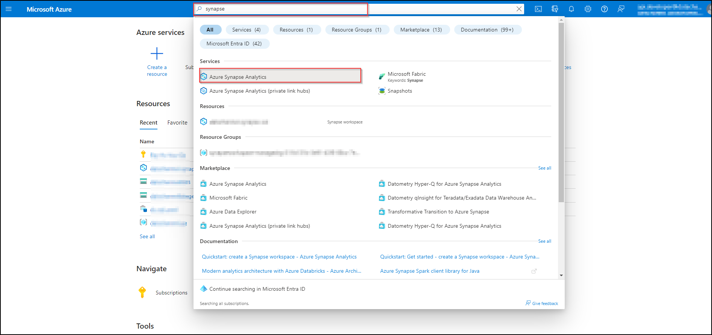
2. In the search results, under Services, select Azure Synapse Analytics. This will list all the workspaces.
3. Open the desired Synapse workspace from the list by clicking on it. 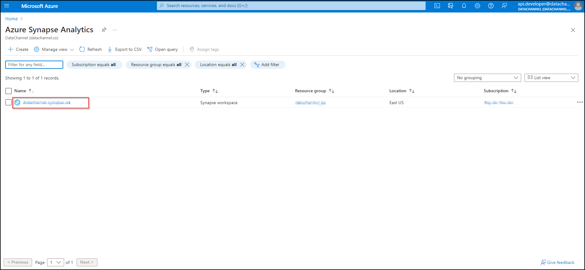
4. This will give you the overview of the selected Synapse workspace. 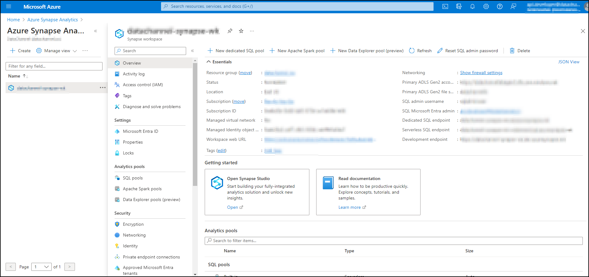
5. In the navigation, under Analytics Pools, select SQL pools. This will list all the SQL pools in the workspace. Select the dedicated SQL pool created by you by clicking on it. 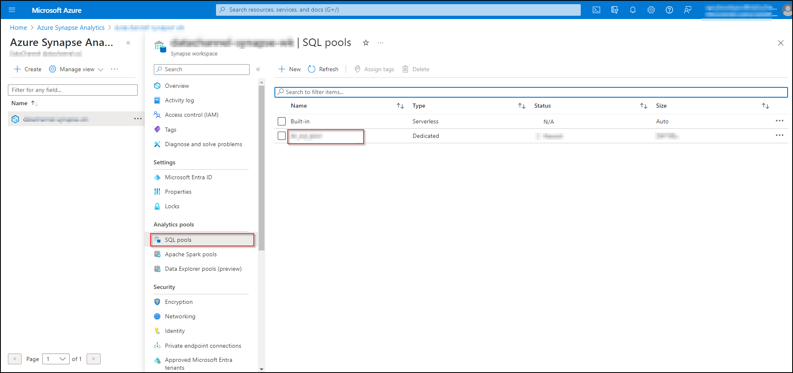
6. You now have the overview of the SQL pool. From the navigation, under Settings, select Connection Strings to view database connection strings. 
7. Once you have reached the Connection Strings page, go to ODBC. 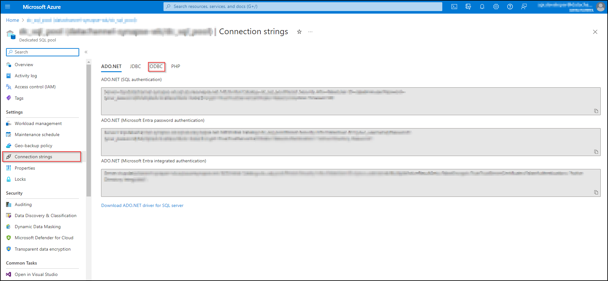
8. Copy the connection string (as indicated in the image) to a notepad. 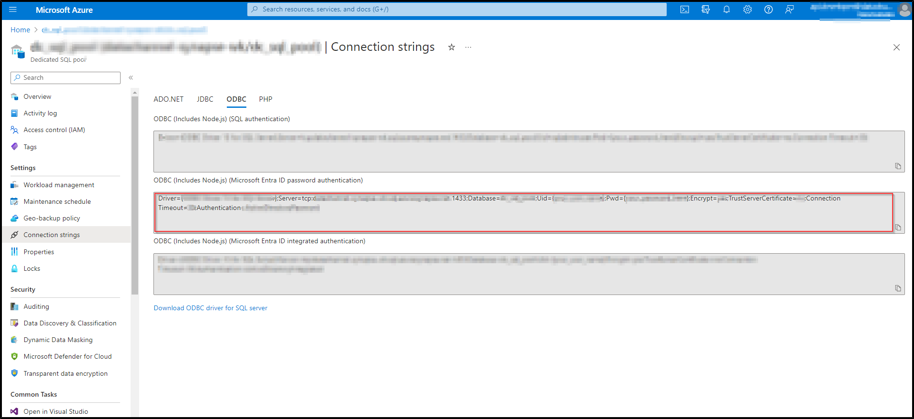
9. The connection string will have the format: 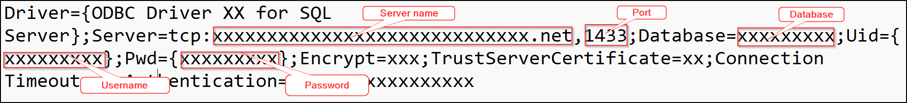
10. Thus, from the above you will be able to find the details of Server name, Port, Database, Username and Password. Please keep these handy as these will be needed at the time of setting up your Warehouse at DataChannel.
11. Go to Workspace overview. Open the workspace in Synapse studio. 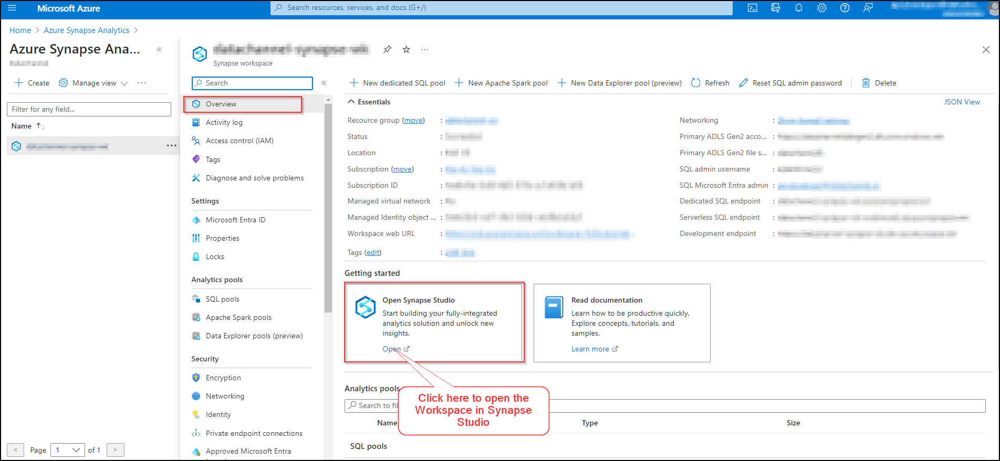
12. Once inside the Synapse Studio, you will be able to view a Workspace navigator on your screen. Here, you will be able to view the SQL databases to which you have access. Choose the database and select the dedicated SQL pool. Click on schemas to view the schema names. Make a note of the Schema name where you wish to load data.

```
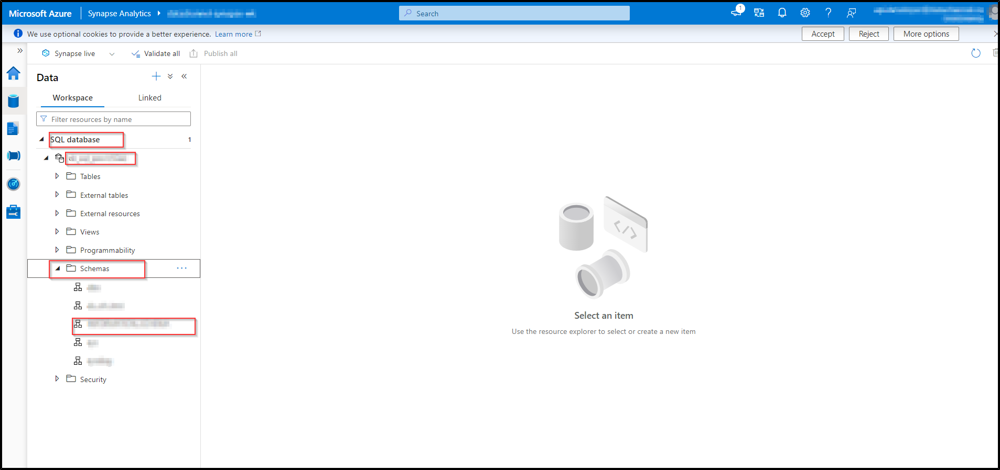
```

### To find your Azure Blob Storage Details

You’ll be needing certain Azure Blob Storage details when configuring your Data Warehouse at DataChannel:

1. Open the Azure portal, and at the top search for Storage accounts. 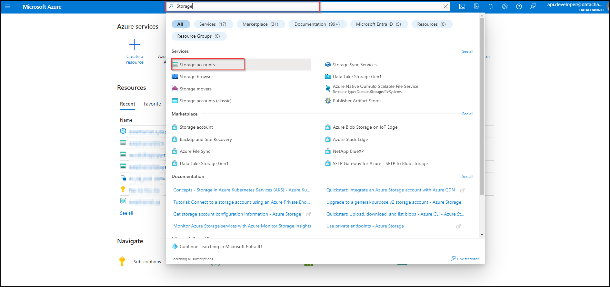
2. From the listed storage accounts, navigate to the storage account that you would like to connect to your data warehouse. Click on it. 
3. On the account overview page, go to the Security + Networking menu and select Access Keys. 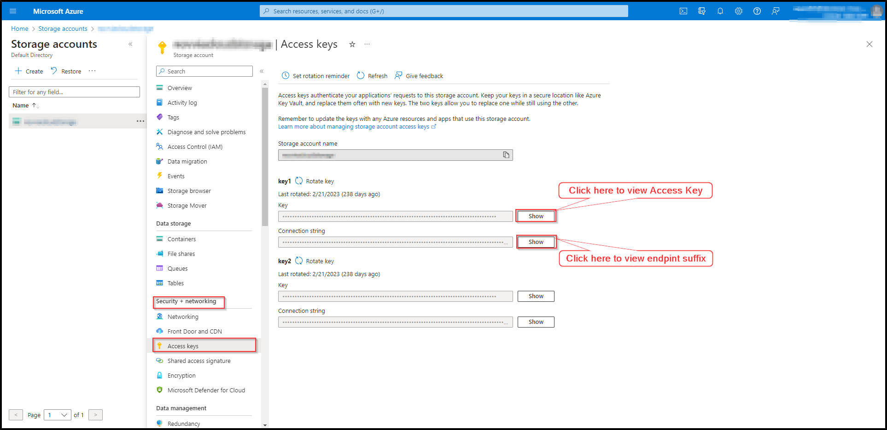
4. Click on the show button to view and copy the Access Key.
5. Click on the show button to view and copy the connection string associated with the access key. Paste it in a text document. You will note that the endpoint suffix is given at the end of the connection string. 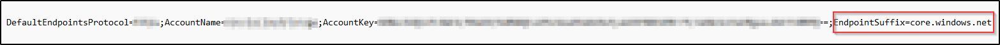
6. Please make a note of the storage account name, access key and endpoint suffix as these details will be required when configuring your warehouse.
7. On the account overview page, go to the Data Storage menu and select Containers. 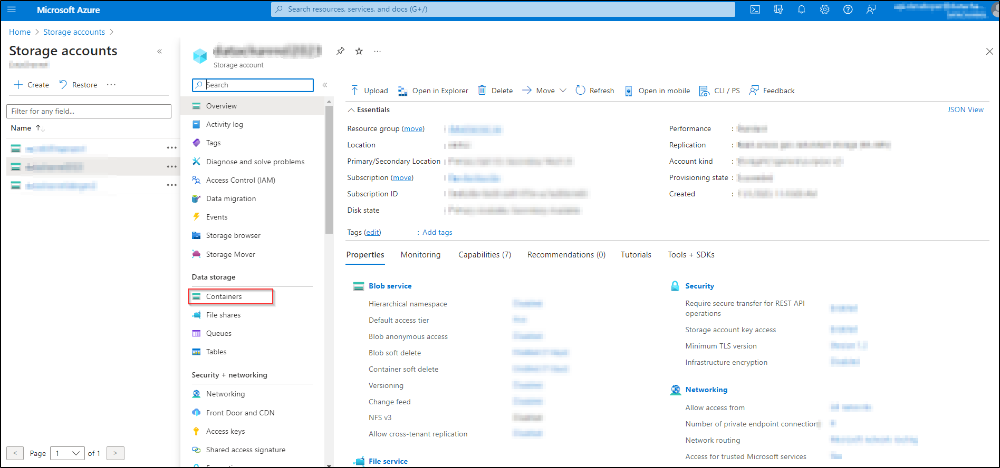
8. Here, you will be able to view the list of containers. Make a note of the Container name where you wish to load data.

```
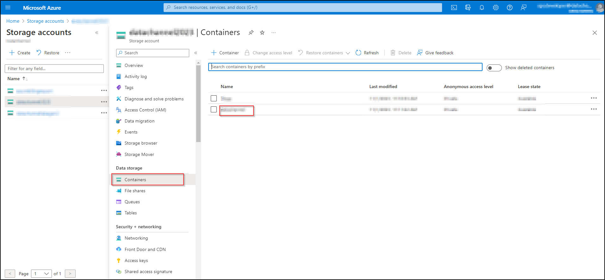
```

### Step By Step Guide for Adding a new Azure Synapse Analytics warehouse to your DataChannel Account

**Step 1:**

Click on the Data Warehouses tab in the left side bar navigation to reach the Data Warehouses Module as shown below.


**Step 2:**

Click on **Add New** to add a new Data Warehouse to your account.

**Step 3:**

Select _Azure Synapse Analytics_ from listed options and click on **Add Warehouse Details**.


**Step 4:**

Enter the details for your Azure Synapse Analytics and Azure Blob Storage in the form and click on **Validate Configuration**.


**Step 5:**

Once the configuration is validated, the warehouse will be added.
