# BigQuery

**Experimental**

## Introduction

Google BigQuery is one of the most popular, scalable, easy to manage data warehouse options for those wanting to setup a Data Warehouse on the cloud. Read more about the features and how to get started with the popular platform [here](https://cloud.google.com/bigquery/docs).

In case you wish to use this platform to host your data that you are aggregating using DataChannel, you can either setup a cluster of your own or use a DataChannel Managed BigQuery Warehouse. This document will show you how you can connect / provision a BigQuery based warehouse in minutes using the DataChannel Platform.

## Self Managed Google BigQuery Warehouse

> **Prerequisites for connecting your BigQuery Cluster**
>
> * Ensure that you've created a Google Cloud project in your BigQuery Warehouse. The project name, project ID and project number will be visible to you on the _Dashboard_ page of your Google Cloud console. Keep this project information handy when configuring your Warehouse to allow DataChannel to interact with your Google Cloud resources. For more information on creating and managing projects click [here](https://cloud.google.com/resource-manager/docs/creating-managing-projects).
> * Create dataset(s) in BigQuery using the Google Cloud console. The Dataset ID, Dataset name and location must be known to you when configuring DataChannel. You may use the Google Cloud Console _Explorer_ panel to expand a project name to see the datasets in that project, or use the search box to search by dataset name. For more information on creating datasets click [here](https://cloud.google.com/bigquery/docs/datasets).
> * Create a Google cloud storage bucket in _the same region as your cluster_. DataChannel will need you to share information about the Bucket name where you hold your data in Google Cloud Storage. You can create a bucket using the Google Cloud console from the Cloud Storage _Buckets_ page. For more information on creating buckets click [here](https://cloud.google.com/storage/docs/discover-object-storage-console).
> * Ensure the required permissions as discussed in the next section have been granted.

### To find your Google BigQuery Details

You’ll be needing certain Google BigQuery details when configuring your Data Warehouse at DataChannel:

1. Go to the Welcome page in the Google Cloud console.
2. From the project picker at the top of the page, select your project. 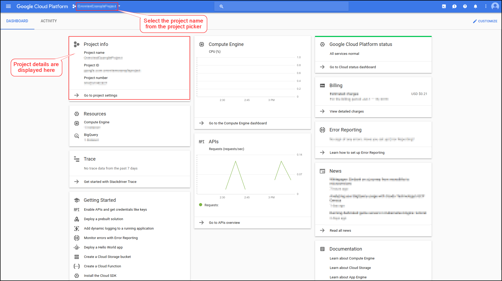
3. The _project name_, _project number_ and _project ID_ appear after the Welcome heading.
4. In the Google Cloud console, go to the Cloud Storage Buckets page.
5. In the bucket list, click the name of the bucket whose metadata you want to view.
6. You can now view bucket details such as the _bucket name_, _bucket location_ etc. 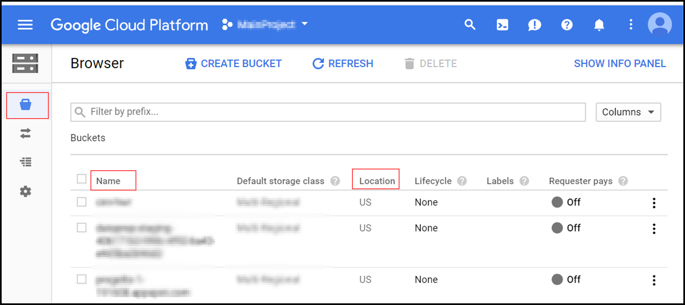
7. In the Explorer pane, expand your project and select a dataset.
8. In the Details panel, you can view the dataset such as _Dataset ID_, _Dataset name_, _Dataset location_ etc. 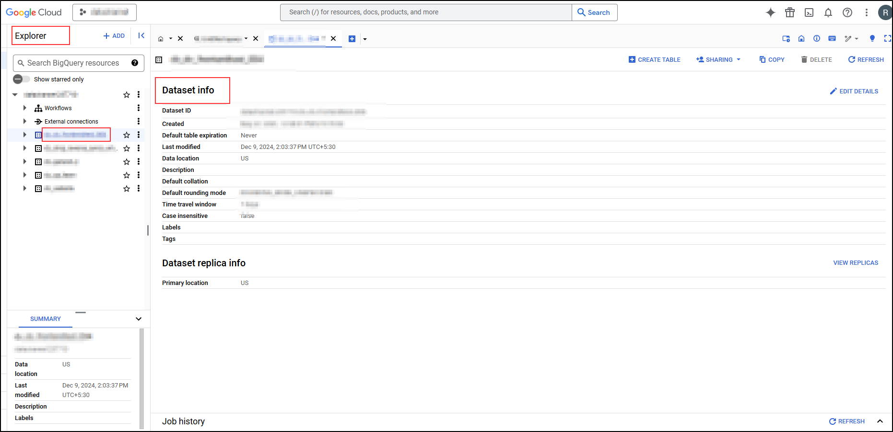

### Permissions

DataChannel will need certain permissions to access your projects, folders and objects in order to write to/ edit them when connecting using pipelines / syncs. Since you are the owner/administrator of your BigQuery Warehouse, you will need to manage access to your resources. You can do this by either of the two ways:

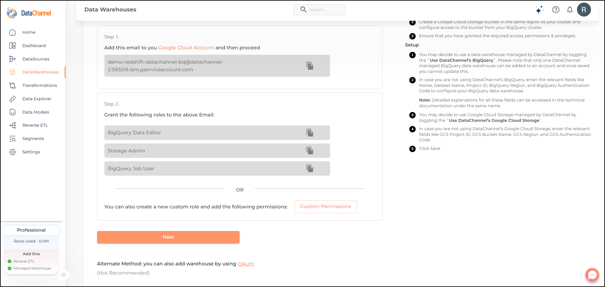

* _Option 1:_ Grant the following roles to the DataChannel Principal:
  * BigQuery Data Editor
  * Storage Admin
  * BigQuery Job User
* _Option 2:_ You can create a custom role granting the required privileges/ permissions and associate it to the DataChannel Principal. Creating a custom role will help you to ensure that we have only the permissions we need, thus enabling you to control access at a more granular level (rather than the much broader predefined roles).

You can read and understand more about creating custom roles by clicking [here](https://cloud.google.com/iam/docs/creating-custom-roles). This Video Tutorial by Google Cloud Tech will also prove useful to educate you about Managing access with cloud IAM.

[Video: ZTpOAmJWhAk](https://www.youtube.com/watch?v=ZTpOAmJWhAk)

The following permissions are needed by DataChannel. What each permission implies is also given alongside:

* bigquery.config.get - Get details about a configuration.
* bigquery.datasets.get - Get metadata about a dataset.
* bigquery.jobs.create - Create new jobs.
* bigquery.tables.create - Create new tables.
* bigquery.tables.data.insert - Insert data into tables.
* bigquery.tables.data.list - List data in tables.
* storage.objects.create - Create objects in buckets.
* storage.objects.delete - Delete objects from buckets.

### _Step By Step Guide for adding a new BigQuery Data warehouse to your DataChannel Account_

**Step 1:** Click on the Data Warehouses tab in the left side bar navigation to reach the Data Warehouses Module as shown below. 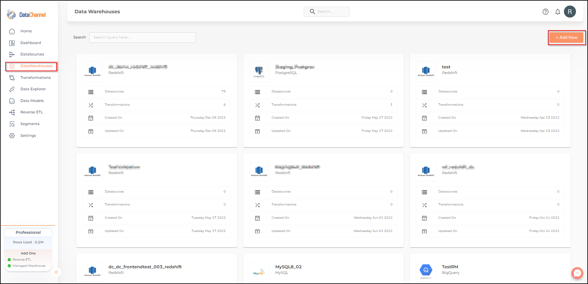

**Step 2:** Click on **Add New** to add a new Data Warehouse to your account.

**Step 3:** Select _**BigQuery**_ from the listed Warehouse options. 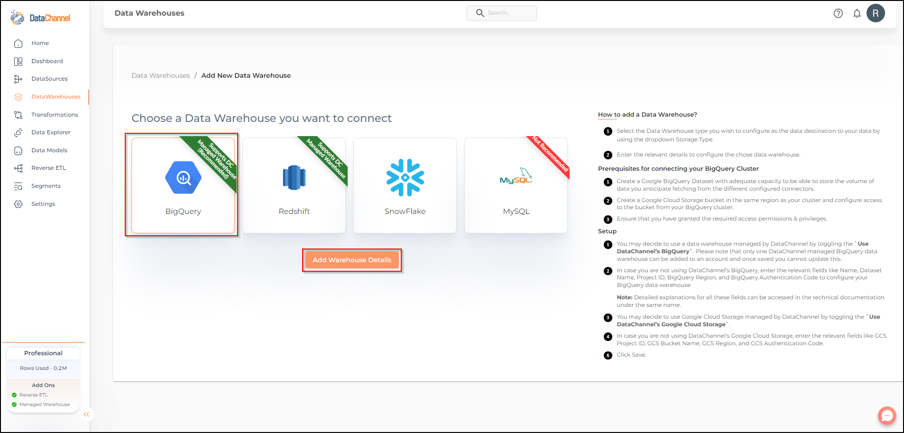

**Step 4:** You may choose to opt for a DataChannel Managed warehouse. 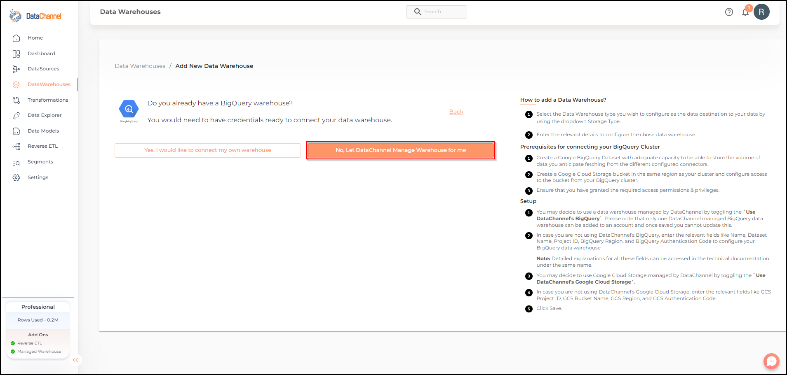

**Step 5:** Else, you may choose to connect your own warehouse. You would need to have credentials ready to connect your data warehouse.

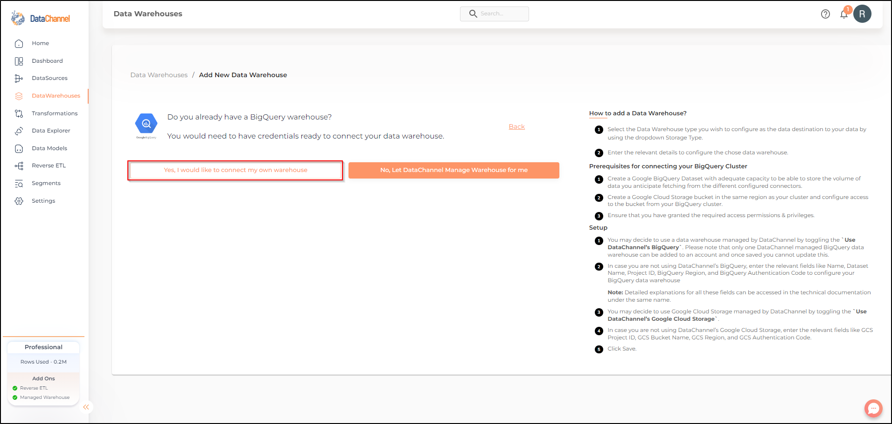

#### Option 1 : Adding your own BigQuery Data warehouse to your DataChannel Account

**Step 6:** Add the given email to your google cloud account and ensure that you have granted the permissions listed. Click on **Next**. 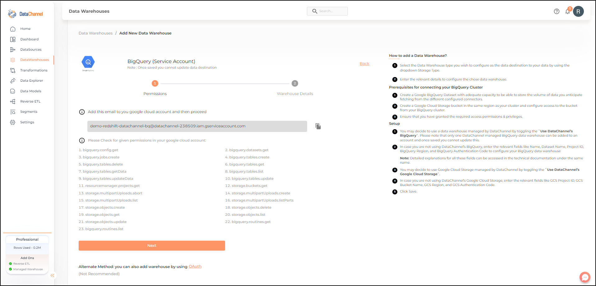

**Step 7:** Enter the details for your BigQuery Dataset in the form and click on **Validate Configuration** to add the warehouse. An explanation of each of the fields in the form is given in the table below. Refer to the presetup documentation above to know how to get this information for your project. 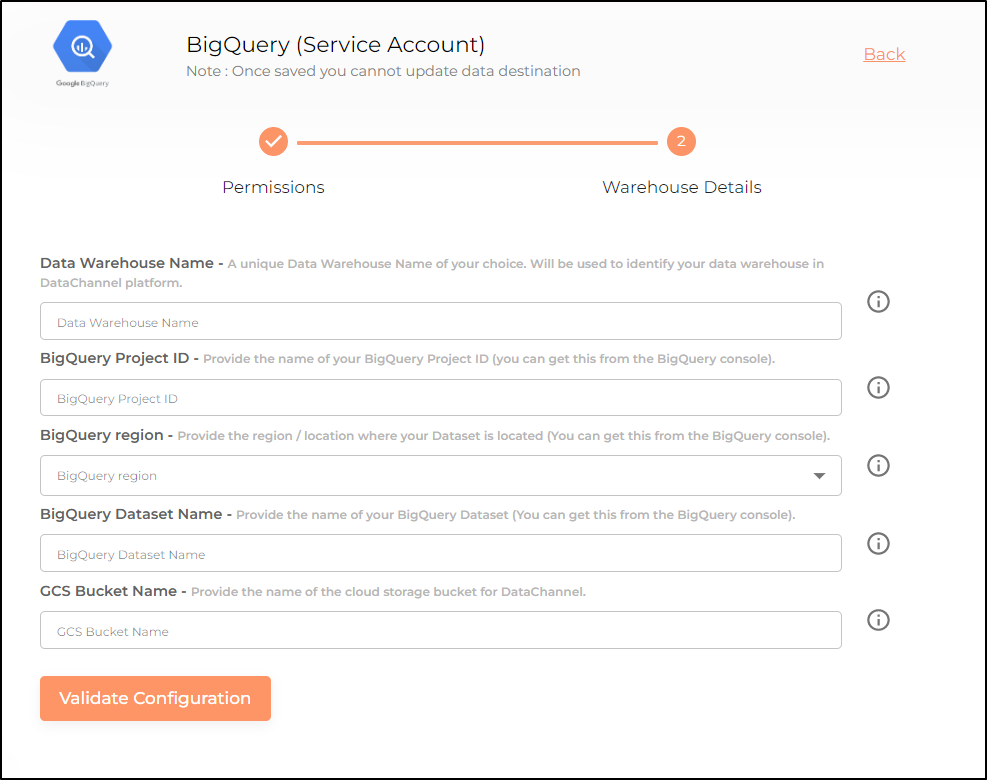

| Field                        | Description                                                                                                                                                                                                                                                                                                                                        |
| ---------------------------- | -------------------------------------------------------------------------------------------------------------------------------------------------------------------------------------------------------------------------------------------------------------------------------------------------------------------------------------------------- |
| Name                         | 
<em>Required</em> Provide a name for your warehouse. It needs to be unique across your account.
                                                                                                                                                                                                                                          |
| Dataset Name                 | 
<em>Required</em> Provide the name of your BigQuery Dataset (you can get this from the BigQuery console).
                                                                                                                                                                                                                                |
| Project ID                   | 
<em>Required</em> Provide the project ID for the cloud project which has the BigQuery Dataset.
                                                                                                                                                                                                                                           |
| BigQuery Region              | 
<em>Required</em> Provide the region / location where your Dataset is located.
                                                                                                                                                                                                                                                           |
| BigQuery Authentication Code | 
<em>Required</em> Click on the link <strong>Generate Authentication Code</strong> and follow the process given <a href="set-up:authentication.adoc">here</a> to generate a code using OAuth2
                                                                                                                                             |
| Use DataChannel GCS          | 
<em>Required</em> Leave this toggle off so that you can specify your own GCS bucket.
                                                                                                                                                                                                                                                     |
| GCS Project ID               | 
<em>Required</em> Provide the project ID where you have created the Google Cloud Storage Bucket to store the raw data files. Note that DataChannel does not remove the files after they have been copied into GCS so it is advisable to use life cycle properties to manage the removal / archival of the raw files to manage GCS costs.
 |
| GCS Bucket Name              | 
<em>Required</em> Provide the name of the cloud storage bucket you have created for DataChannel.
                                                                                                                                                                                                                                         |
| GCS Region Name              | 
<em>Required</em> Provide the name of the region where your GCS Bucket is stored. Note:- This should be same as the region for your BigQuery Dataset.
                                                                                                                                                                                    |
| GCS Authentication Code      | 
<em>Required</em> Click on the link <strong>Generate Authentication Code</strong> and follow the process given <a href="set-up:authentication.adoc">here</a> to generate a code using OAuth2
                                                                                                                                             |

#### Option 2: Adding a DataChannel Managed BigQuery Data warehouse to your DataChannel Account

**Step 6:** In case you choose that DataChannel manage a BigQuery warehouse for you, the process to add a DataChannel managed warehouse is very simple. Just fill in your Google Account email and Region and click on **save**. 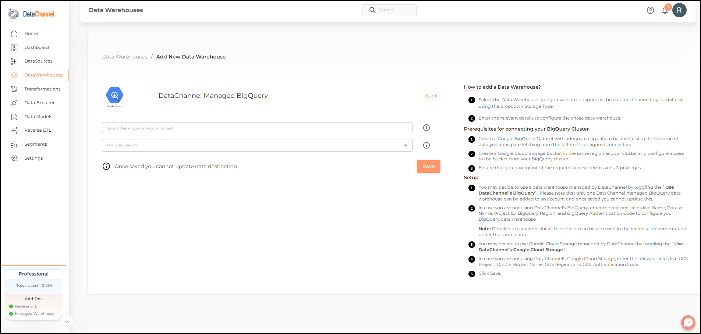