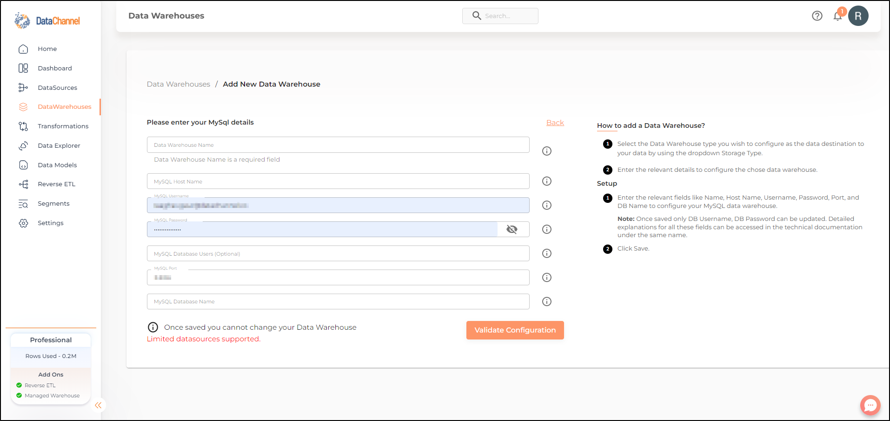

# MySQL

## Introduction

MySQL is an open-source relational database management system (RDBMS). It organizes data into one or more data tables in which data types may be related to each other; these relations help structure the data. MySQL works with an operating system to implement a relational database in a computer's storage system, manages users, allows for network access and facilitates testing database integrity and creation of backups.

Read more about its features and how to get started with the popular platform [here](https://dev.mysql.com/doc/).

### To find your MySQL Details

You’ll be needing certain MySQL details when configuring your Data Warehouse at DataChannel:

1. Connect to your MySQL admin account by providing a username and a password. If you have connected successfully, you will get a `mysql>` prompt which tells you that mysql is ready for you to enter SQL statements.
2. MySQL account names consist of a user name and a host name. *Account name* syntax is 'user_name'@'host_name'. Using the CURRENT_USER() function returns the *user name* and *host name* combination for the MySQL account that the server used to authenticate the current client. The syntax is:

    ```sql
    mysql> SELECT CURRENT_USER();
    ```

3. To connect DataChannel to your MySQL account, you will need to provide the *password* that you use to access the MySQL Database.
4. Alternatively, you may *create a new user* for DataChannel from your admin account and assign a password to it. The CREATE USER statement creates new MySQL accounts using the following syntax:

    ```sql
    CREATE USER 'dc_user'@'%.example.com' IDENTIFIED BY 'password';
    GRANT ALL
      ON *.*
      TO 'dc_user'@'%.example.com'
      WITH GRANT OPTION;
    ```

    Here you have created a superuser account with the username ‘dc_user’ with full global privileges to do anything.

5. You will need to specify the MySQL *Database Name* when configuring the warehouse. Use the SHOW statement to list the databases managed by the server.

    ```sql
    mysql> SHOW DATABASES;
    ```

6. MySQL uses *port* 3306 by default. If you are using any port other than the default port, make sure you specify the correct network port that is configured on the server.

## Step By Step Guide

**Step 1:**
Click on Data Warehouses tab in the left side bar navigation to reach the Data Warehouses Module as shown below.


**Step 2:**
Click on btn:[Add New] to add an additional Data Warehouse to your account.

**Step 3:**
Select *_MySQL_* from the listed Warehouse options.


**Step 4:**
Enter the details about your MySQL in the form and click on btn:[Save] to add the warehouse. An explanation of each of the fields in the form has been given below.


| Field               | Description                                                                 |
|---------------------|-----------------------------------------------------------------------------|
| Data Warehouse Name | *_Required_*<br>Provide a name for your warehouse. It needs to be unique across your account. This can be accessed from the Warehouses Tab. |
| Host Name           | *_Required_*<br>Provide a host name for your warehouse. MySQL hostname defines the location where your MySQL database is hosted. You need to specify the MySQL hostname so that DataChannel knows where to connect. |
| Username            | *_Required_*<br>Provide a username which will be used to create the tables and load data. This user needs to have all rights on the database, datawarehouse(only usage), and the schema you intend to use. In case you are creating a dedicated schema for the data from DataChannel (which is recommended, then this user can be the schema owner. |
| Password            | *_Required_*<br>Provide the password for the username entered above.          |
| Port                | *_Required_*<br>Provide the port number.                                    |
| DB Name             | *_Required_*<br>Provide the name of the database you have created in your MySQL instance. |