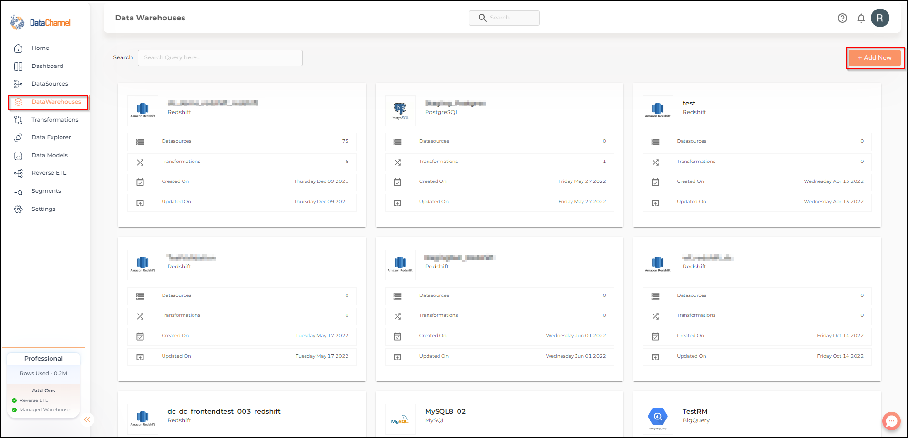

# AWS Redshift Data Warehouse

**Experimental**

## Introduction

Amazon Redshift is one of the most popular, scalable, easy to manage data warehouse options for those wanting to setup a Data Warehouse on the cloud. Read more about the features and how to get started with the popular platform from AWS [here](https://docs.aws.amazon.com/redshift/index.html).

In case you wish to use this platform to host your data that you are aggregating using DataChannel, you can either setup a cluster of your own or use a DataChannel Managed Redshift Warehouse. This document will show you how you can connect / provision a Redshift based warehouse in minutes using the DataChannel Platform.

## Self Managed Redshift Cluster

**Prerequisites for connecting your Redshift Cluster**

* If you don't already have an AWS account, create and activate an AWS account. Set up your data warehouse with AWS Redshift. The AWS Redshift console will allow you to create and manage your Redshift resources. 
* Connect to your AWS Redshift as an admin user ( Or any user which has permissions to create databases, users and schemas). Using the AWS Redshift console you can launch query editor v2 by clicking on the Query data button.  The query editor v2 connects from your client machine to the AWS Redshift environment. You need to create a database to be used for DataChannel by running this query:

```sql
create database <DATABASE_NAME>;```

Substitute the placeholder in the above query with the desired *Database name*. You may choose any name  for your Database but keep in mind that the Database name should be 1-64 characters. Valid characters are lowercase alphanumeric characters. This database is where DataChannel will actually create tables, load data, and run queries.

If you don’t have access to query editor v2, you can use any database client ( E.g Dbeaver) to connect to your redshift and run the same queries.

* By default, only the admin user that you created when you created your AWS Account has access to the resources that you have created. Thus, to grant DataChannel access to your resources you will need to create a new user. At the time of creating a new DataChannel user, you will need to specify a name  and a password for this new user. The password for the user must have 8–64 characters, and it must include at least one uppercase letter, one lowercase letter, and one numeral. A database comprises one or more schemas which contain tables and other database objects. Schemas help to organize database objects into logical groups so that their management becomes easier. So, on running this query using the Query Editor v2/ your Database Client,  you can connect to this database and create a new user and schema.Substitute the placeholder in the above query with the desired Database name.

```sql
create user <USERNAME> password '<PASSWORD>';
create schema <SCHEMA_NAME> authorization <USERNAME>; # This will create and give ownership of the schema to this user
```

Substitute the placeholders in the above query with the desired *Username*, *password* and *Schema name*. Please make a note of these as you will require them when configuring your warehouse with DataChannel.

* Ensure that you've created an S3 bucket in your AWS Redshift Warehouse.  You can use the following steps to create an Amazon S3 Bucket. 1. Use your AWS account's *email address* and *password* to Sign in to your AWS Management Console.
 2. Open the Console *Home* page.
 3. In the Services search Box, search for S3.  4. From the search results, select *S3*. 5. Choose Buckets from the Amazon S3 menu in the left navigation pane and then choose the Create bucket button.
 6. Enter a *name* for your bucket. 7. Select the *AWS Region* where you would like your bucket to be created.
 8. You may choose to enable or disable Bucket Versioning.
 9. Navigate to the bottom of the page and click on Create bucket.

Please make a note of the S3 bucket name and region as you will need them later.

* To grant DataChannel access to your S3 bucket, you will need to create an IAM role with appropriate permissions. Refer AWS documentation [here](https://docs.aws.amazon.com/redshift/latest/gsg/rs-gsg-create-an-iam-role.html) to learn how to create and manage your IAM Role.

**Tips**

* It is recommended to create a new schema for DataChannel in your database.
* Ensure that the S3 bucket name and region are correct as they will be used later during the configuration process.

## Step By Step Guide

Step 1: Click on Data Warehouses tab in the left side bar navigation to reach the Data Warehouses Module.



Step 2: Click on Add New to add a new Data Warehouse to your account.

Step 3: Select *Redshift* from the listed Warehouse options.


Step 4: You may choose to opt for a DataChannel Managed warehouse.


Step 5: Else, you may choose to connect your own warehouse. You would need to have credentials ready to connect your data warehouse.


### Option 1 : Adding your own Redshift Data warehouse to your DataChannel Account

Step 6: Enter the details for your AWS Redshift and S3 Bucket in the form and click on Validate Configuration to add the warehouse. An explanation of each of the fields in the form is given in the table below.

|Field|Description|
|---|---|
|Name|Provide a name for your warehouse. It needs to be unique across your account. |
|Host|Provide the hostname or end-point for the cluster. |
|Username|Provide a username which will be used to create the tables and load data. This user needs to have all rights on the schema that you intend to use. In case you are creating a dedicated schema for the data from DataChannel (which is recommended), then this user can be the schema owner.|
|Password|Provide the password for the load user.|
|Select Users|Comma separated list of users who should get select rights on tables created by DataChannel using the schema and username specified by you.|
|Port|Provide the port number for your cluster. The default value for this is 5439 unless you have changed it while creating your redshift cluster.|
|DB Name|Provide the name of the database you have created in your cluster.|
|Schema Name|Provide the database schema where DataChannel should push the data. As mentioned above, it is recommended to create a new schema for DataChannel in your database.|
|Use DataChannel S3|Leave this toggle off so that you can specify your own S3 bucket. |
|AWS Location|Provide the AWS region where your S3 bucket has been created. This should typically be same as the region in which your Redshift cluster is hosted. Example `us-east-1`|
|Bucket Name|Provide name of the S3 bucket where DataChannel should copy files before loading them into your Redshift instance. Note that DataChannel does not remove the files after they have been copied into Redshift so it is advisable to use life cycle properties to manage the removal / archival of the raw files to manage S3 costs.|
|Access Key|Provide the access key required to access the S3 bucket using the API. Refer AWS documentation [here](https://docs.aws.amazon.com/general/latest/gr/aws-access-keys-best-practices.html) to learn how to manage your access keys.|
|Secret Key|Provide the secret key required to access the S3 bucket using the API. Refer AWS documentation [here](https://docs.aws.amazon.com/general/latest/gr/aws-access-keys-best-practices.html) to learn how to manage your secret keys.|
|IAM Role|Provide the IAM role required to access the S3 bucket using the API. Refer AWS documentation [here](https://docs.aws.amazon.com/redshift/latest/gsg/rs-gsg-create-an-iam-role.html) to learn how to create and manage your IAM Role.|