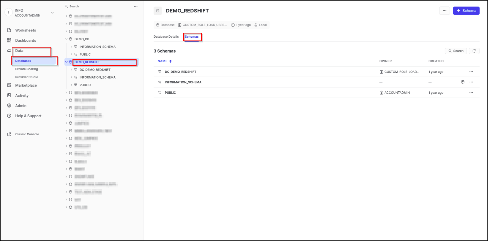
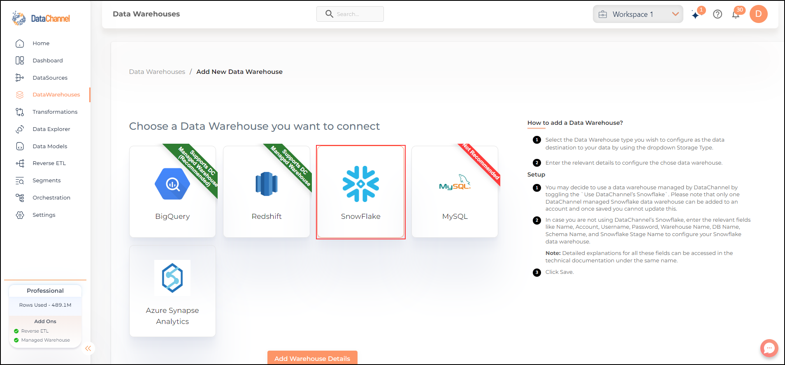
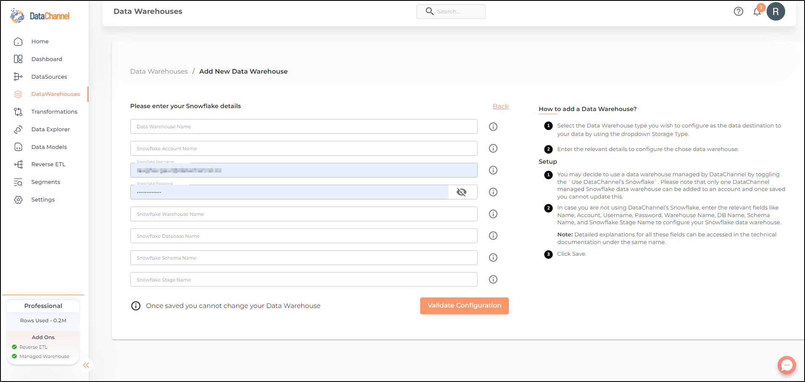

# Snowflake

## Introduction

Snowflake enables data storage, processing, and analytics solutions that are flexible, fast, and easy to use. It was not built on any existing database technology or “big data” software platforms such as Hadoop. Instead, Snowflake combines a completely new SQL query engine with an innovative architecture natively designed for the cloud.

Read more about its features and how to get started with the popular platform [here](https://docs.snowflake.com/en/user-guide.html).

This document will show you how you can connect / provision a Snowflake based warehouse in minutes using the DataChannel Platform.

> **Prerequisites for connecting your Snowflake Cluster**
>
> * Create a Snowflake Cluster with adequate capacity to be able to store the volume of data you anticipate storing.

### To find your Snowflake Details

You’ll be needing certain Snowflake details when configuring your Data Warehouse at DataChannel:

1. Before you can execute SQL statements you must sign into a Snowflake account.
2. In a supported web browser, navigate to [https://app.snowflake.com](https://app.snowflake.com).
3. You can sign into Snowflake using your _Snowflake account name_ and your Snowflake account credentials (_username_, and _password_).
4.  You can view the account name in the URLs for accessing any of the Snowflake web interfaces. The URL for an account uses the following format:

    ```
    https://<account_name>.snowflakecomputing.com.
    ```
5.  You can write the following SQL queries using the Worksheets page on the Snowflake web interface:

    ```sql
    SHOW WAREHOUSES;
    SHOW DATABASES;
    SHOW SCHEMAS;
    SHOW STAGES;
    ```

    In the query results you will see the lists of all the warehouses,databases, schemas and stages for which you have access privileges, across your entire account. Please make a note of the details of all the resources that you would like to be accessed by DataChannel.
6. Alternatively , these details about database name, schema name and stage name are also visible to you from the Snowflake web interface. To know more refer [Snowflake documentation](https://docs.snowflake.com/en/user-guide/ui-snowsight-quick-tour#data-pages).
   *   If you use the classic Snowflake Console the _warehouse name_, _database name_, _schema name_ and _stage name_ details are visible near the top right corner of the screen as shown below:

       
   *   If you use the Snowsight web interface the _warehouse name_, _database name_, _schema name_ and _stage name_ details are visible from the _Data_ menu as shown below:

       

## Step By Step Guide

**Step 1:**

Click on Data Warehouses tab in the left side bar navigation to reach the Data Warehouses Module as shown below.


**Step 2:**

Click on **Add New** to add an additional Data Warehouse to your account.

**Step 3:**

Select _Snowflake_ from the listed Warehouse options.



**Step 4:**

Enter the details about your Snowflake cluster in the form and click on **Save** to add the warehouse. An explanation of each of the fields in the form has been given below.



| Field                | Description                                                                                                                                                                                                                                                                                                                                                      |
| -------------------- | ---------------------------------------------------------------------------------------------------------------------------------------------------------------------------------------------------------------------------------------------------------------------------------------------------------------------------------------------------------------- |
| Name                 | <p><em>Required</em><br>Provide a name for your warehouse. It needs to be unique across your account.</p>                                                                                                                                                                                                                                                        |
| Account              | <p><em>Required</em><br>Provide your Snowflake account name here. You can access directly from the URL. Example: ACCOUNT NAME.snowflakecomputing.com</p>                                                                                                                                                                                                         |
| Username             | <p><em>Required</em><br>Provide a username which will be used to create the tables and load data. This user needs to have all rights on the database, datawarehouse(only usage), and the schema you intend to use. In case you are creating a dedicated schema for the data from DataChannel (which is recommended), then this user can be the schema owner.</p> |
| Password             | <p><em>Required</em><br>Provide the password for the username entered above.</p>                                                                                                                                                                                                                                                                                 |
| Warehouse Name       | <p><em>Required</em><br>Provide the name of the Warehouse. This can be accessed from the Warehouses Tab.</p>                                                                                                                                                                                                                                                     |
| DB Name              | <p><em>Required</em><br>Provide the name of the database you have created in your Snowflake instance.</p>                                                                                                                                                                                                                                                        |
| Schema Name          | <p><em>Required</em><br>Provide the database schema where DataChannel should push the data. As mentioned above, it is recommended to create a new schema for DataChannel in your database.</p>                                                                                                                                                                   |
| Snowflake Stage Name | <p><em>Required</em><br>Provide the Internal Stage name here that should be used to load data to tables. This internal stage should be created in the same database which is being used to load data. This can be accessed from the Databases Tab. Cick on the Database you are using and Go to the Stages Tab.</p>                                              |
