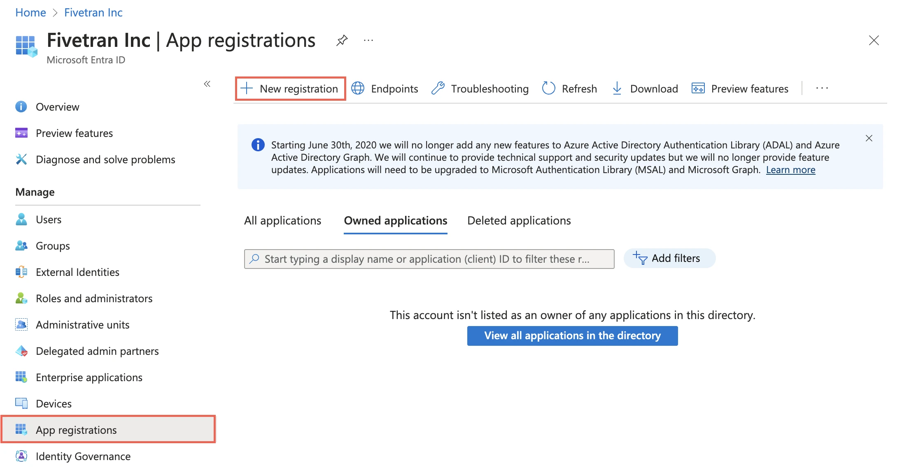

# OneLake

You can connect your Microsoft Fabric OneLake data lake to DataChannel by providing a few essential configuration details. This guide walks you through each required setting step by step, including workspace identifiers and client secret authentication.

### ✍️ Getting Started

To connect OneLake, you’ll need:

* Fabric Identifiers: Workspace ID, Lakehouse ID, and Tenant ID.
* Authentication: Client ID and Secret Value (Service Principal) for secure access.

<figure><figcaption></figcaption></figure>

***

### 🛠 Connection Details

Below are the details required to configure a OneLake connection.

**1. Name**

Choose a unique name for this OneLake data warehouse configuration. This helps you identify the warehouse later if you have multiple Fabric or other data warehouse connections.

* Examples: `prod-fabric-onelake`, `finance-lakehouse-east`
* ⚠️ The name must be unique for each warehouse you add.

**2. Workspace ID**

Enter your Microsoft Fabric Workspace ID. This is the unique identifier for the workspace where your lakehouse resides.

**3. Lakehouse ID**

Provide the unique ID of the specific Fabric Lakehouse you want to connect to. This ensures data is routed to the correct destination within your workspace.

**4. Tenant ID**

Enter your Azure Tenant ID. This is required to route authentication requests to the correct Azure Active Directory instance.

***

### 🔐 Authentication

DataChannel uses Client Secret Authentication to securely connect to your OneLake environment. This method utilizes an Azure Service Principal.

**Client ID**

The application (client) ID of your Azure Service Principal.

* Example: `12345678-abcd-1234-efgh-1234567890ab`

**Secret Value**

The secret value associated with your Client ID.

* 🔒 This value is securely masked in the UI.

> ℹ️ Ensure that your Service Principal has the necessary Contributor or Data Warehouse permissions within the Fabric workspace to perform data operations.

***

#### ✅ Final Notes

* Path Validation: DataChannel automatically constructs the table path using the format: `abfss://[Workspace_ID]@onelake.dfs.fabric.microsoft.com/[Lakehouse_ID]/Tables`.
* Security: Using a Service Principal (Client Secret) is the recommended way to manage programmatic access to Fabric without using individual user credentials.
* Verification: Once configured, DataChannel will validate the connection to ensure it can successfully reach your Lakehouse Tables and Files.
