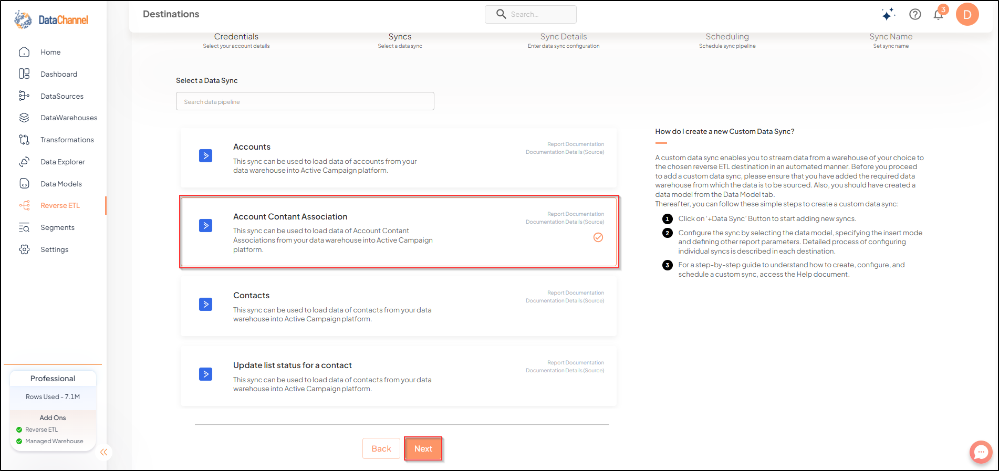

# Account Contact Association

This sync can be used to load data of Account Contact Associations from your data warehouse into Active Campaign platform.

## SETUP

### Configuring the CredentialsSelect the account credentials which has access to relevant Active Campaign account from the given list & Click on Next

**Credentials not listed?** Click on + for adding new credentials and fill the form that pops-up.

.png>)

## Data Sync Details

Data Sync: Select _Account Contact Association_ & click on Next

Data Model:Select a Data Model from the drop-down.

## Setting Parameters

| Parameter        | Description | Values                                                                                                                                                                                                                                                                       |
| ---------------- | ----------- | ---------------------------------------------------------------------------------------------------------------------------------------------------------------------------------------------------------------------------------------------------------------------------- |
| Fields Selection | _Required_  | Select the field(s) you would like to push in your Active Campaign platform here. Note that it is mandatory to map the `contact_id` and `account_id` fields to respective model fields.                                                                                      |
| Fetch Mode       | _Required_  | This refers to the manner in which data will get updated : FULL will update the entire column(s) from the selected data, INCREMENTAL will update the fresh record(S) added since last fetch                                                                                  |
| Incremental Key  | _Dependant_ | _Required (If Fetch Mode = Incremental)_                                                                                                                                                                                                                                     |
| Insert Mode      | _Required_  | This refers to the manner in which data will be updated in the Active Campaign Platform; with 'Update' selected, the data will be updated (only existing records) and with 'Append' selected, all data fetched will be inserted. Selecting 'Delete' will delete the records. |

## Scheduling Syncs


