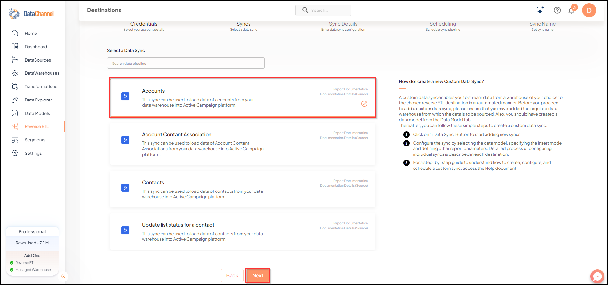
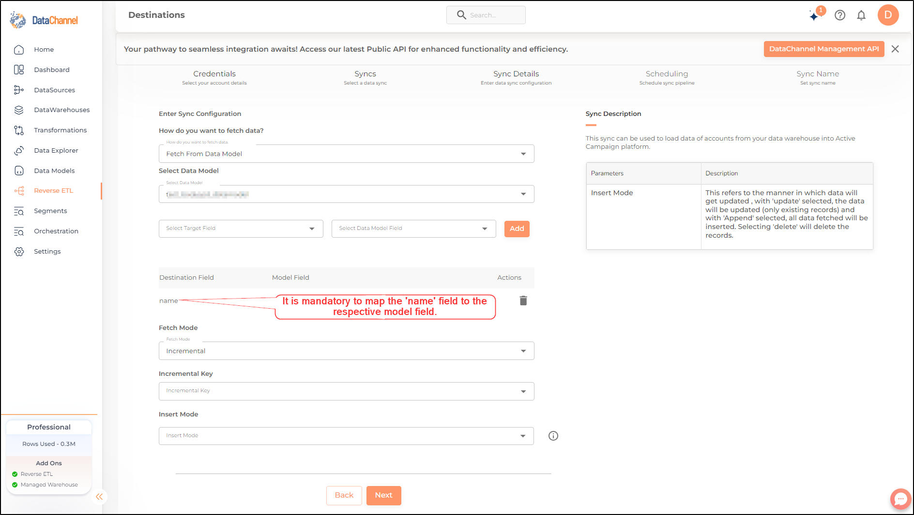

# Accounts

This sync can be used to load data of accounts from your data warehouse into Active Campaign platform.

## SETUP
### Configuring the CredentialsSelect the account credentials which has access to relevant Active Campaign account from the given list & Click [Next]

**Credentials not listed?**
Click on [+] for adding new credentials and fill the form that pops-up.

## Data Sync Details
Data Sync:
Select *Accounts* & click [Next]

Account:Select an account from the drop-down

Data Model:Select a Data Model from the drop-down

## Setting Parameters

| Parameter | Description | Values |
|-----------|-------------|--------|
| Fields Selection | *Required*  | Select the field(s) you would like to push in your Active Campaign platform here. Note that it is mandatory to map the `name` field to a respective model field. | {Destination Field Name, Model Field Name} |
| Fetch Mode | *Required*  | This refers to the manner in which data will get updated : FULL will update the entire column(s) from the selected data, INCREMENTAL will update the fresh record(S) added since last fetch | {Incremental, Full} **Default Value:** FULL |
| Incremental Key | *Dependant*  | *Required (If Fetch Mode = Incremental)*  | Choose the field which will serve as Incremental key. | Select Incremental Key |
| Insert Mode | *Required*  | This refers to the manner in which data will be updated in the Active Campaign Platform; with 'Update' selected, the data will be updated (only existing records) and with 'Append' selected, all data fetched will be inserted. Selecting 'Delete' will delete the records. | `Update`, `Append`, `Delete` |

# Scheduling Syncs
include::ROOT:partial$name_schedule_syncs.adoc[]