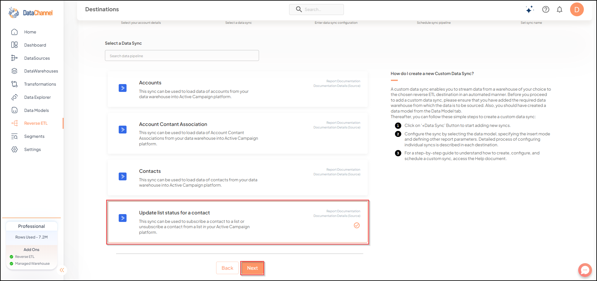
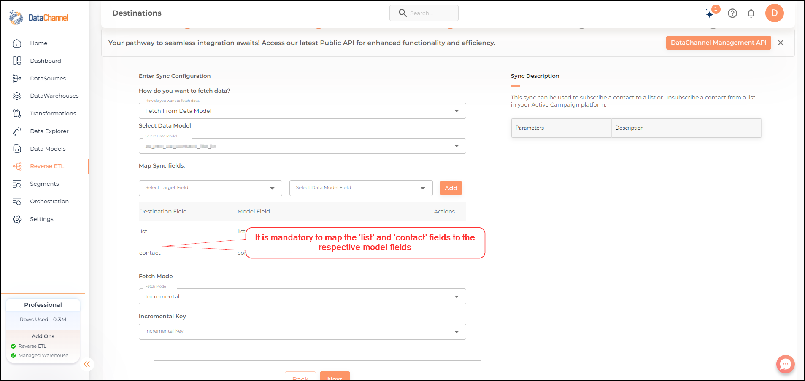

# Update List Status for a Contact

This sync can be used to subscribe a contact to a list or unsubscribe a contact from a list in your Active Campaign platform.

## SETUP
### Configuring the CredentialsSelect the account credentials which has access to relevant Active Campaign account from the given list & Click on Next

****

Credentials not listed ?:
Click on + for adding new credentials and fill the form that pops-up.
****

## Data Sync Details
Data Sync::
Select *Update List Status for a Contact* & click on Next

Data Model::Select a Data Model from the drop-down.

## Setting Parameters

| Parameter | Description | Values |
|-----------|-------------|--------|
| Fields Selection | *Required*   Select the field(s) you would like to push in your Active Campaign platform here. Note that it is mandatory to map the `list` and `contact` fields to respective model fields. | {Destination Field Name, Model Field Name} |
| Fetch Mode | *Required*   This refers to the manner in which data will get updated : FULL will update the entire column(s) from the selected data, INCREMENTAL will update the fresh record(S) added since last fetch | {Incremental, Full}   _Default Value:_ FULL |
| Incremental Key | *Dependant*   *Required (If Fetch Mode = Incremental)*   Choose the field which will serve as Incremental key. | Select Incremental Key |

## Scheduling Syncs
include::ROOT:partial$name_schedule_syncs.adoc[]