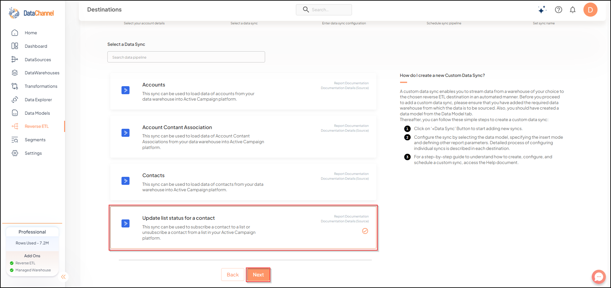

# Update List Status For A Contact

This sync can be used to subscribe a contact to a list or unsubscribe a contact from a list in your Active Campaign platform.

## SETUP

### Configuring the CredentialsSelect the account credentials which has access to relevant Active Campaign account from the given list & Click on Next

***

Credentials not listed ?: Click on + for adding new credentials and fill the form that pops-up.

***

.png>)

## Data Sync Details

Data Sync:: Select _Update List Status for a Contact_ & click on Next

Data Model::Select a Data Model from the drop-down.

## Setting Parameters

| Parameter        | Description                                                                                                                                                                                                                      | Values                                                     |
| ---------------- | -------------------------------------------------------------------------------------------------------------------------------------------------------------------------------------------------------------------------------- | ---------------------------------------------------------- |
| Fields Selection | 
<em>Required</em> Select the field(s) you would like to push in your Active Campaign platform here. Note that it is mandatory to map the <code>list</code> and <code>contact</code> fields to respective model fields.
 | {Destination Field Name, Model Field Name}                 |
| Fetch Mode       | 
<em>Required</em> This refers to the manner in which data will get updated : FULL will update the entire column(s) from the selected data, INCREMENTAL will update the fresh record(S) added since last fetch
          | 
{Incremental, Full} <em>Default Value:</em> FULL
 |
| Incremental Key  | 
<em>Dependant</em> <em>Required (If Fetch Mode = Incremental)</em> Choose the field which will serve as Incremental key.
                                                                                            | Select Incremental Key                                     |

## Scheduling Syncs


