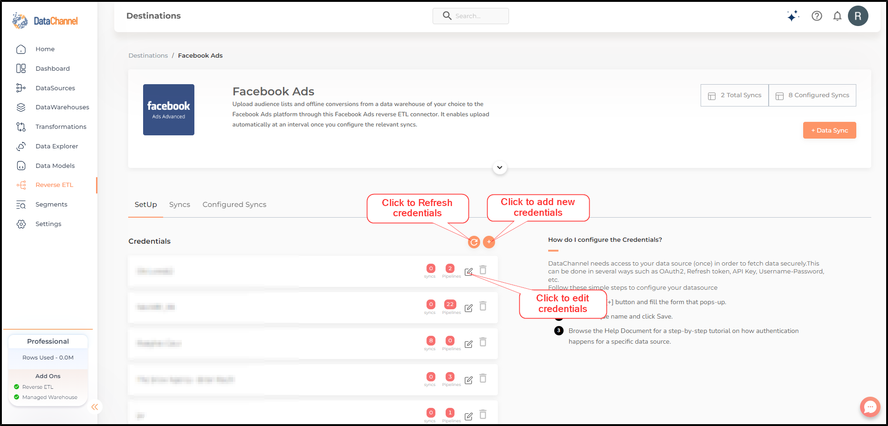
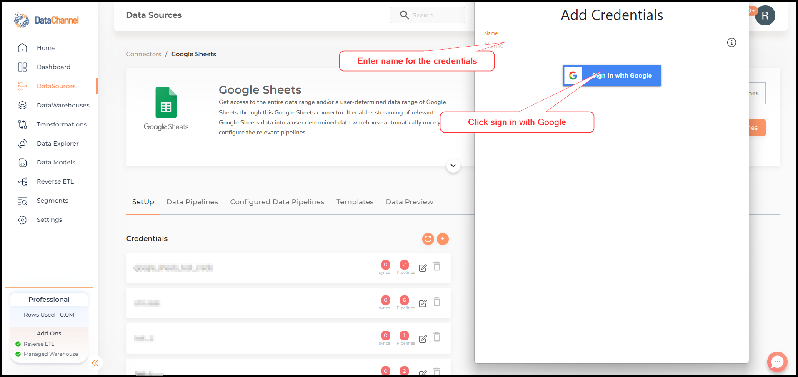
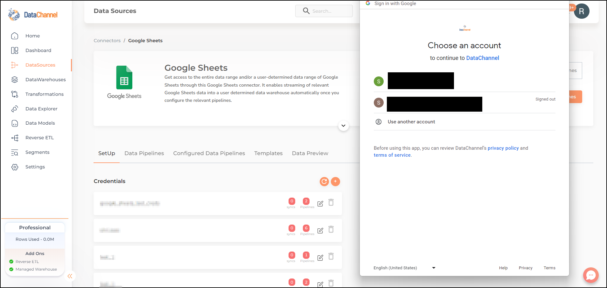
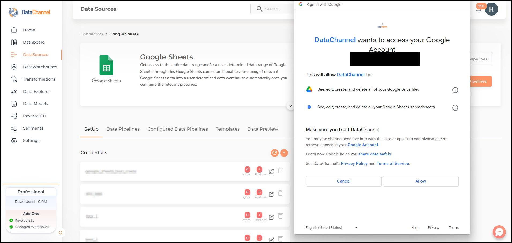
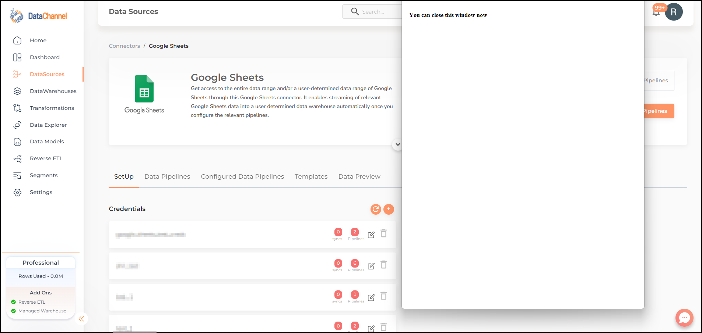
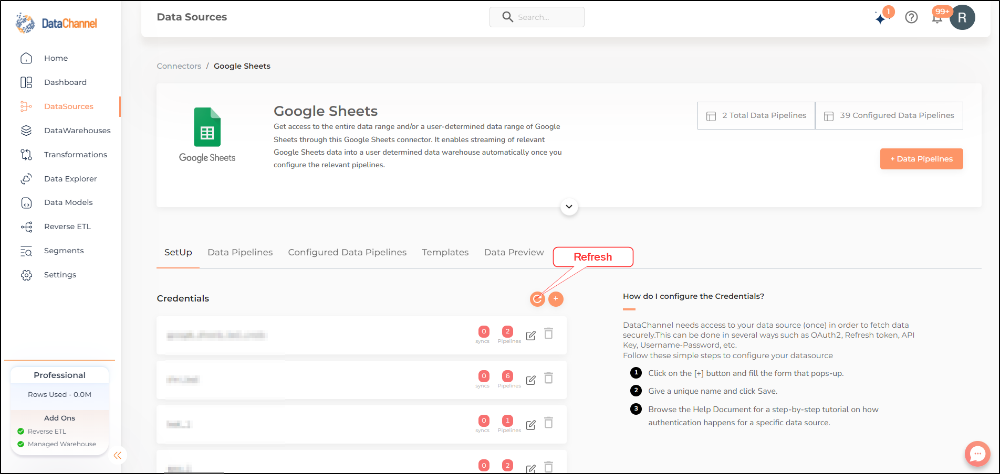

# Authenticating your Cloud Application

DataChannel needs to be able to connect to your cloud application API in order to fetch data. Typically this means adding a set of credentials to DataChannel for us to connect to the application. The most secure and preferred way of doing this is to use [OAuth2](https://oauth.net/2/) or Open Authentication to connect. This ensures that you do not have to share your credentials at any time and only need to authorise the DataChannel app to connect to your account by logging in to your account once. There may be some platforms which do not have support for OAuth, in which case you will need to follow the process for connecting which that platform supports.

This document will explain the typical process needed to connect a cloud application using OAuth to DataChannel. This is using Google Sheets as an example but the process for connecting is same for all data sources which support OAuth.

## Connecting using OAuth

**Step 1:** Go to the DataSource page for the application you wish to connect and click on **Credentials** tab.

**Step 2:** Click on **Add New** to add a new set of credentials.

**Step 3:** Give your credentials a name and click Save.

**Step 4:** A pop-up window which will prompt you to login to the cloud application account (In this instance Google Account) will open up. In case you have multiple accounts, you may have to select one account. In case you have one account and you are logged in already, this step may be skipped.

**Step 5:** Grant permission to DataChannel app to access data in your account. Please review carefully the permissions being shared with the app. We try to work with the most restrictive and minimum required permissions to fetch the data from the platform. However, by agreeing to this step you are agreeing to let DataChannel access data in your account, so please review the scope.

**Step 6:** Close this window.

**Step 7:** Refresh credentials.

New credentials have been successfully added, and should be visible in the credentials list.