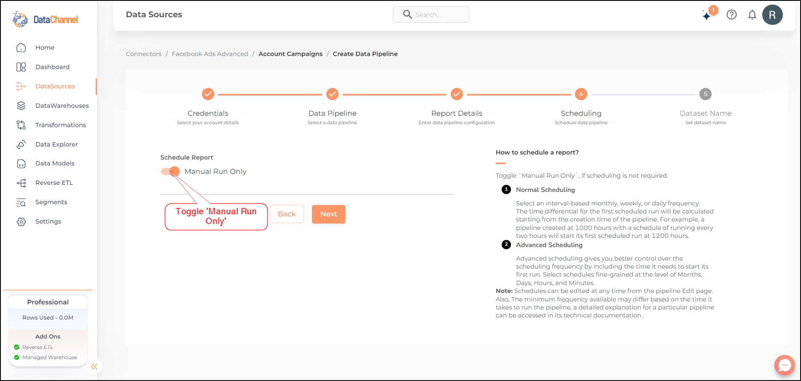
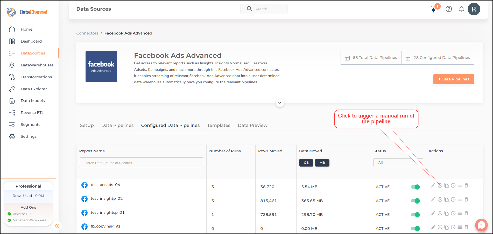
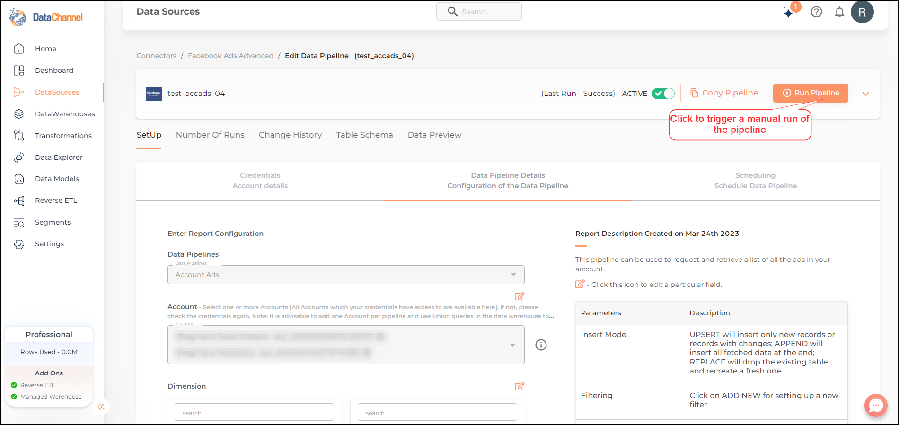
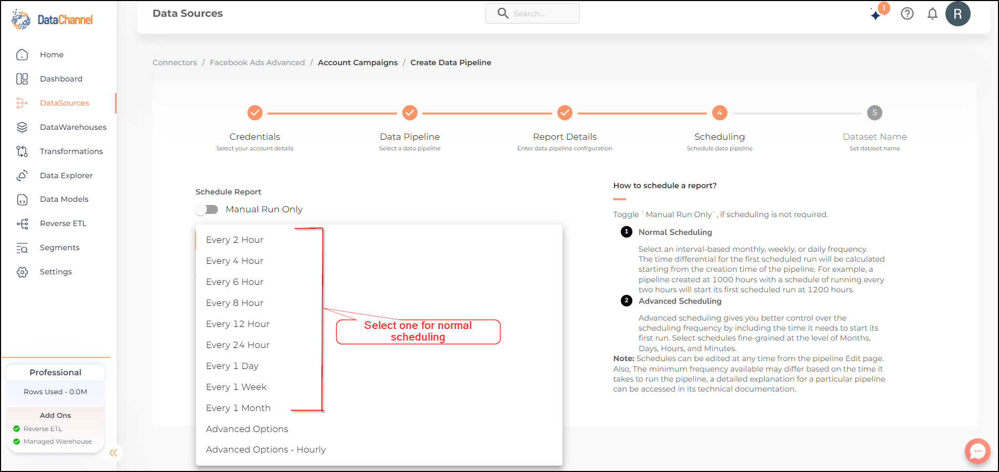
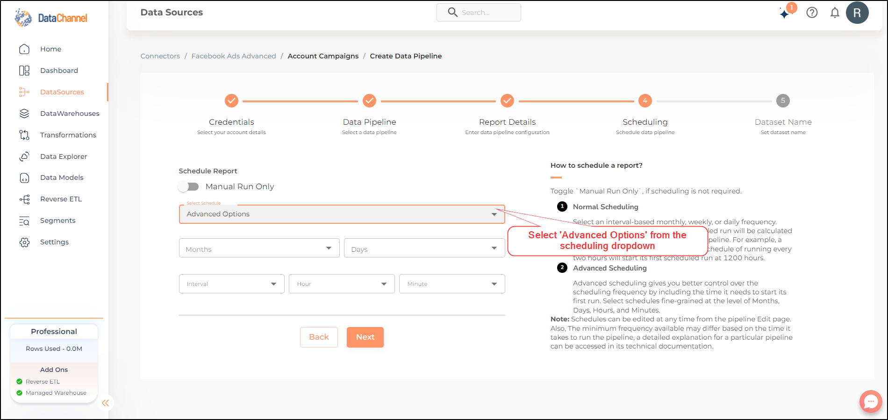
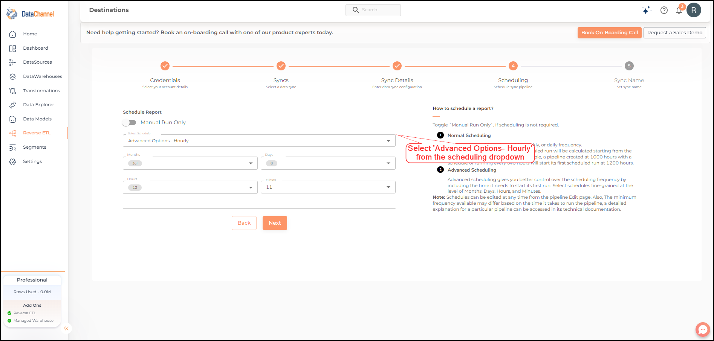
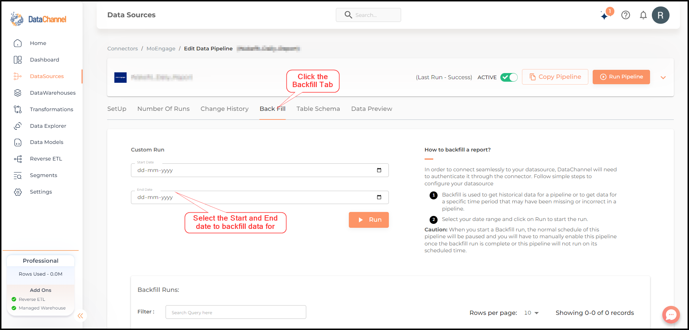

# Scheduling & Running Data Pipelines

## Concepts

DataChannel offers three modes of running / executing your Data Pipelines. The most common way is to schedule the pipelines to run on a pre-defined time schedule, but you also have the option of manual run of a pipeline. Some pipelines also have a option of BackFill run available, which can be used to get historical data for a pipeline.

## Manual Run

In order to run a pipeline only when needed, you can set its schedule to Manual Run only as shown in the image below.

There are three possible ways in which you can trigger a manual run of a pipeline anytime you choose. These are by clicking the run now button on the report details page, or in the actions column of the pipeline listing section of the Home page / Data Sources page. These are shown in the images below.

## Scheduled Run

In order for a pipeline to run on schedule, you can set its schedule during the pipeline creation process. This schedule can be edited at any time from the pipeline Edit page as well.

There are two options for scheduling a pipeline:-

* [Normal](#normal-scheduling)
* [Advanced](#advanced-scheduling)

### Normal Scheduling

This scheduling options requires you to select a frequency for running the pipeline from the scheduling tab of the report creation / edit page as shown below. The min frequency available may differ from pipeline to pipeline based on the time it takes to run the pipeline.

**NOTE:** The time differential for the first scheduled run will be calculated from the time of creation of the pipeline. For example a pipeline created at 1000 with a schedule of running every two hours will start its first scheduled run at 1200.

### Advanced Scheduling

The advanced scheduling option gives you a fine grained control over when to run your pipelines including the time it needs to start its first run. Ref image below for details.

## Backfill

This option is not available for all pipelines and would be visible for only those pipelines where it is feasible to get data for a specified time range. This option can be used to get historical data for a pipeline or to get data for a specific time period which may be missing or incorrect due to some reason.

**CAUTION:** When you start a Backfill run, the normal schedule of the pipeline is paused and you will have to manually enable the pipeline once the back fill run is complete or the pipeline will not run on its scheduled time.

In order to trigger a backfill run follow these steps

1. Go to the report details page and click on the **Backfill** tab.
2. Select your date range and click on **Run** to start the run.

