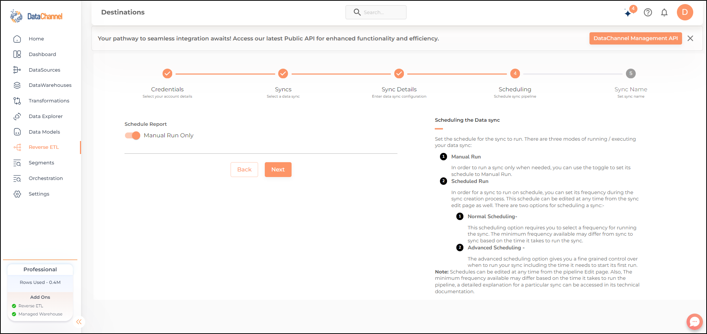
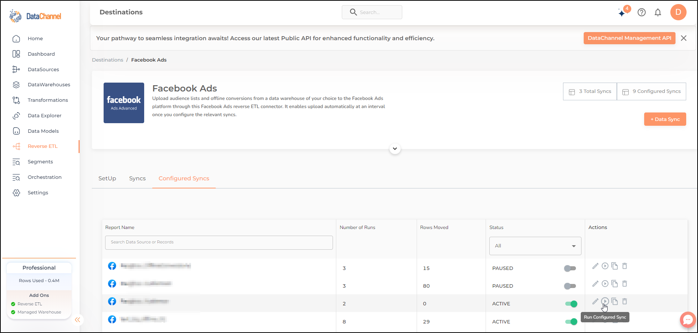
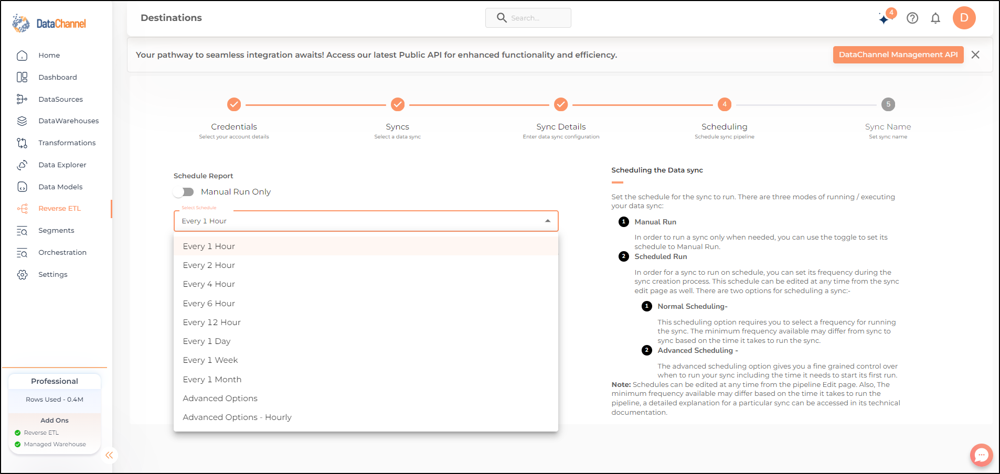
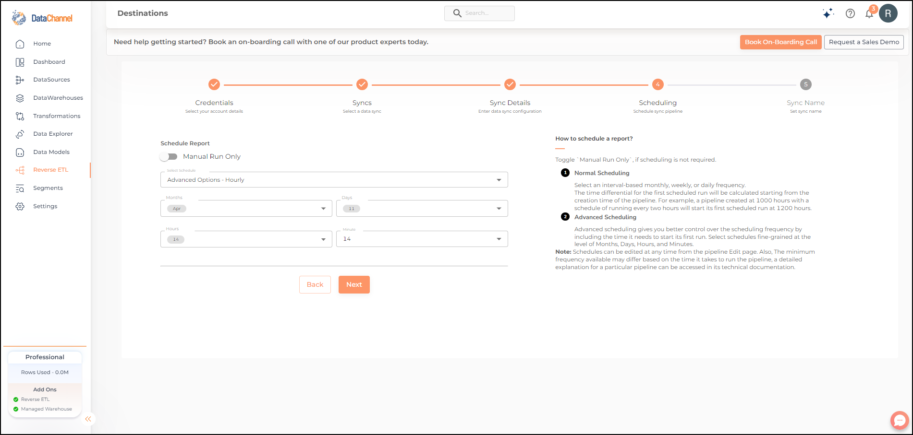

# Scheduling & Running Data sync

## Concepts

DataChannel offers three modes of running / executing your data sync. The most common way is to schedule the sync to run on a pre-defined time schedule, but you also have the option of manual run of a sync.

## Manual Run

In order to run a sync only when needed, you can set its schedule to Manual Run only as shown in the image below.

## Scheduled Run

In order for a sync to run on schedule, you can set its schedule during the sync creation process. This schedule can be edited at any time from the sync edit page as well.

There are two options for scheduling a sync:

* [Normal](#normal-scheduling)
* [Advanced](#advanced-scheduling)

### Normal Scheduling

This scheduling options requires you to select a frequency for running the sync from the scheduling tab of the report creation / edit page as shown below. The min frequency available may differ from sync to sync based on the time it takes to run the sync.

**NOTE:** The time differential for the first scheduled run will be calculated from the time of creation of the sync. For example a sync created at 1000 with a schedule of running every two hours will start its first scheduled run at 1200.

### Advanced Scheduling

The advanced scheduling option gives you a fine grained control over when to run your sync including the time it needs to start its first run. Ref image below for details.

